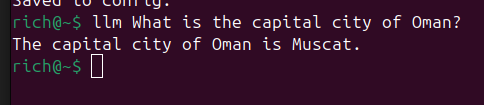
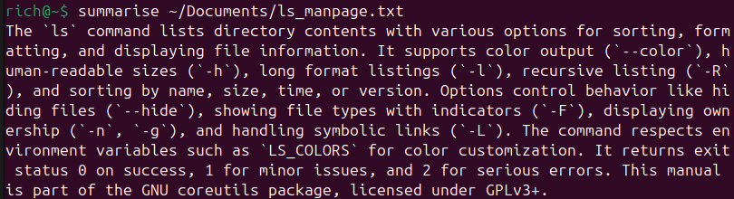
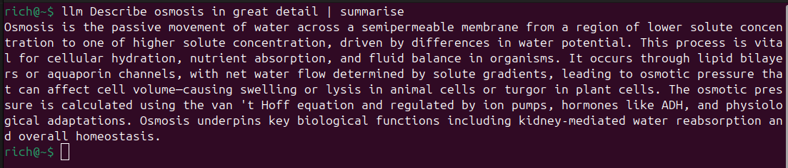
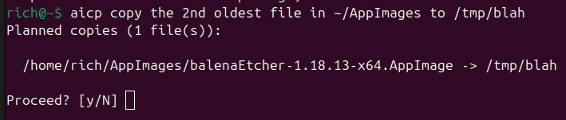
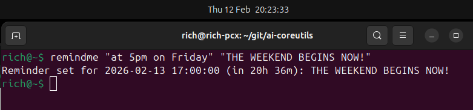
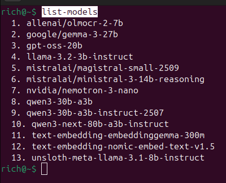
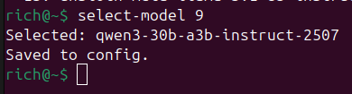

# ai-coreutils

A collection of command-line utilities powered by a local LLM. Each tool is a small, focused binary that uses a locally-hosted language model (via an OpenAI-compatible API such as [LM Studio](https://lmstudio.ai)) to perform a specific task.

Built with .NET 10, [Microsoft.Extensions.AI](https://devblogs.microsoft.com/dotnet/introducing-microsoft-extensions-ai-preview/), and the [Microsoft.Agents](https://github.com/microsoft/Agents-for-.NET) SDK.

## Utilities

### llm

General-purpose LLM prompt from the command line.

```
llm "Explain the difference between TCP and UDP in two sentences"
```

Streams the response to stdout.



### summarise

Summarise the contents of a text file or piped input.

```
summarise meeting-notes.txt
llm "Explain quantum physics to me" | summarise
cat article.txt | summarise
```

Accepts a file path or reads from stdin when piped. Produces a concise summary scaled to the complexity of the input. Streams to stdout.





### aicp

Natural-language file copy. Describe what you want to copy in plain English and the LLM figures out the rest.

```
aicp ~/Documents/report.pdf /tmp/
aicp "all PDFs in this folder to ~/Documents"
aicp "copy the newest file from ~/AppImages to /tmp"
```

Supports explicit paths (like `cp`), natural language, or a mix of both. The agent has access to a `ListDirectory` tool so it can inspect directories to find files by date, size, or other attributes. All operations are shown as a plan and require confirmation before executing.



### remindme

Schedule a desktop notification using natural language for the time.

```
remindme "in 2 hours" "Take the pizza out"
remindme "tomorrow at 9am" "Stand-up meeting"
```

Uses the LLM to parse the time expression, then schedules a `notify-send` notification via `systemd-run`. Linux only.



### list-models

List all models available on the configured endpoint.

```
list-models
```



### select-model

Choose which model to use by number (from `list-models` output).

```
select-model 3
```

Persists the selection to `~/.ai-coreutils/config.json`.



## Configuration

Configuration is read from `~/.ai-coreutils/config.json` with environment variable overrides (prefixed `AICOREUTILS_`).

| Setting    | Default                    | Env var              | Description                          |
|------------|----------------------------|----------------------|--------------------------------------|
| `Endpoint` | `http://localhost:1234/v1` | `AICOREUTILS_Endpoint` | OpenAI-compatible API base URL     |
| `Model`    | `default`                  | `AICOREUTILS_Model`    | Model identifier to use            |

Example config file:

```json
{
  "Endpoint": "http://localhost:1234/v1",
  "Model": "qwen3-30b-a3b-instruct-2507"
}
```

## Building

Requires [.NET 10 SDK](https://dotnet.microsoft.com/download).

```
dotnet build ai-coreutils.sln
```

All binaries are output to the `Output/` directory. Add it to your `PATH` or invoke them directly:

```
./Output/llm "Hello, world"
```

## Project Structure

```
ai-coreutils/
  Directory.Build.props       # Shared build config (common output directory)
  ai-coreutils.sln
  src/
    Common/                   # Shared library: AgentFactory, ConfigManager, ModelService
      Tools/                  # Agent tools (DirectoryListTool, etc.)
    Llm/                      # llm binary
    Summarise/                # summarise binary
    AiCp/                     # aicp binary
    RemindMe/                 # remindme binary
    ListModels/               # list-models binary
    SelectModel/              # select-model binary
```

Each utility is a standalone executable that references the `Common` library. The common library handles configuration, model loading, and agent creation so the individual tools stay focused and small.

## How It Works

All utilities go through `AgentFactory.CreateAgentAsync()`, which:

1. Reads the endpoint and model from configuration
2. Checks whether the model is already loaded on the LLM host (via the LM Studio API)
3. Loads the model if needed (with flash attention enabled, 16K context)
4. Creates an OpenAI-compatible chat client wrapped as a `Microsoft.Agents.AI.AIAgent`

Each tool then provides its own system prompt and calls the agent with user input, either streaming the response directly (`llm`, `summarise`) or parsing structured output from the LLM to take action (`aicp`, `remindme`).

Agents can optionally be given tools (via `Microsoft.Extensions.AI.AIFunctionFactory`) that the LLM can invoke during execution. For example, `aicp` exposes a `DirectoryListTool` that lets the agent run `ls` (Linux/macOS) or `dir` (Windows) to inspect directory contents by date, size, or name.
